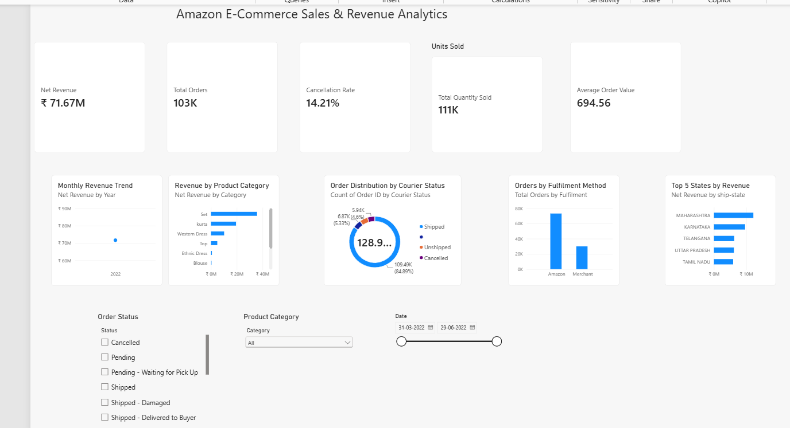

# Amazon E-Commerce Sales & Revenue Analytics

## Project Overview
This project analyzes Amazon e-commerce sales data to understand revenue performance, product categories, order cancellations, fulfillment methods, and regional sales trends.

The project follows an end-to-end data analytics workflow using Python, SQL, and Power BI.

## Tools & Technologies
- Python (Pandas)
- SQL (SQLite)
- Power BI
- DAX
- VS Code

## Dataset
The dataset contains approximately 128,000 Amazon sales transaction records.

Key fields include:
- Order ID
- Date
- Category
- Quantity
- Amount
- Order Status
- Courier Status
- Fulfillment Method
- Shipping State

## Data Cleaning

Python Pandas was used to:

- Handle missing values
- Standardize date formats
- Remove unnecessary columns
- Clean column names
- Create an `Is_Cancelled` indicator
- Export the cleaned dataset for SQL and Power BI analysis

## SQL Analysis

SQL queries were used to analyze:

- Top product categories by revenue
- Monthly revenue trends
- Fulfillment performance
- Order cancellation rates
- Total orders and revenue

The analysis includes SQL concepts such as:

- GROUP BY
- Aggregate Functions
- CTEs
- Filtering
- ORDER BY

## Power BI Dashboard

An interactive Power BI dashboard was created with the following KPIs:

- Net Revenue: ₹71.67M
- Total Orders: 103K
- Units Sold: 111K
- Cancellation Rate: 14.21%
- Average Order Value: ₹694.56

## Dashboard Visualizations

- Monthly Revenue Trend
- Revenue by Product Category
- Order Distribution by Courier Status
- Orders by Fulfillment Method
- Top 5 States by Revenue

Interactive slicers were added for:

- Order Status
- Product Category
- Date Range

## Key Insights

- Set was the highest revenue-generating product category.
- The overall cancellation rate was approximately 14.21%.
- Fulfillment methods showed different cancellation patterns.
- Regional analysis helped identify high-revenue states.
- The dashboard enables interactive analysis by category, order status, and date.

## Project Workflow

Raw Dataset  
→ Python Data Cleaning  
→ Cleaned Dataset  
→ SQLite Database  
→ SQL Analysis  
→ Power BI Dashboard  
→ Business Insights

## Repository Files

- `clean_data.py` - Data cleaning using Pandas
- `create_database.py` - Creates the SQLite database
- `queries.sql` - SQL analysis queries
- `run_sql.py` - Executes SQL queries

## Author

Harikrishna S
